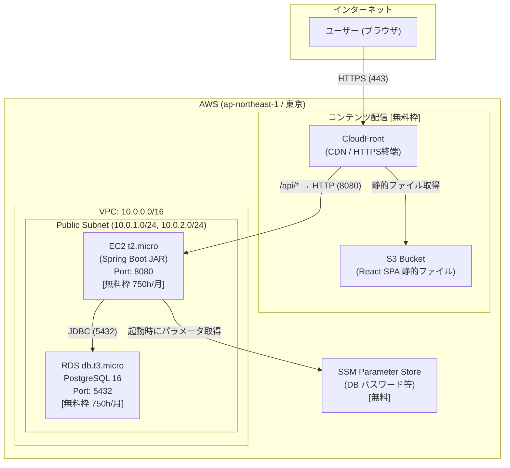

# AWS デプロイガイド — TaskManagementForAI

> **方針:** Terraform による IaC（Infrastructure as Code）でデプロイ。マネジメントコンソール操作は行わない。
> **目的:** 学習用途のため、AWS 無料利用枠内で動く最小構成を優先する。

---

## コスト比較：本番構成 vs 学習構成

| サービス | 本番構成 | 学習構成（今回） | 月額差 |
|---------|---------|----------------|-------|
| バックエンド実行 | ECS Fargate | **EC2 t2.micro** (無料枠) | -$15〜30 |
| ロードバランサー | ALB | **なし**（EC2直接） | -$16〜20 |
| ネットワーク | NAT Gateway + Private Subnet | **Public Subnetのみ** | -$32〜45 |
| シークレット管理 | Secrets Manager | **SSM Parameter Store** (無料) | -$0.40/secret |
| DB | RDS (マルチAZ) | **RDS db.t3.micro** (無料枠, シングルAZ) | 無料 |
| フロントエンド | S3 + CloudFront | **S3 + CloudFront** (無料枠) | 変わらず |
| **合計** | **~$80〜120/月** | **~$0/月**（無料枠内） | **-$80〜120** |

> **無料枠の前提:** AWS アカウント作成から 12 ヶ月以内。EC2 t2.micro・RDS db.t3.micro は各 750 時間/月まで無料。

---

## アーキテクチャ全体図（学習構成）



---

## 本番構成との違いと理由

| 変更点 | 本番 | 学習 | 理由 |
|-------|------|------|------|
| バックエンド | ECS Fargate | **EC2 t2.micro** | Fargate は無料枠なし。EC2 t2.micro は 12ヶ月無料 |
| ロードバランサー | ALB | **なし** | ALB は最低 $16/月。学習では EC2 パブリック IP に直接 CloudFront を向ける |
| ネットワーク | Private Subnet + NAT | **Public Subnet のみ** | NAT Gateway が最大のコスト源（$32〜45/月）。SG で DB へのアクセスを制限することで代替 |
| シークレット管理 | Secrets Manager | **SSM Parameter Store** | Secrets Manager は $0.40/secret/月。SSM Standard パラメータは無料 |
| 冗長化 | マルチAZ | **シングルAZ** | 学習目的のため可用性より低コストを優先 |

> **学習後の本番移行パス:** EC2 → ECS Fargate、Public Subnet → Private Subnet + NAT、SSM → Secrets Manager、シングルAZ → マルチAZ の順に段階的にアップグレードできる。

---

## ネットワーク設計

```
VPC: 10.0.0.0/16
│
├── Public Subnet A (10.0.1.0/24)  ap-northeast-1a  ← EC2, RDS
└── Public Subnet B (10.0.2.0/24)  ap-northeast-1c  ← RDS サブネットグループ用 (※1)
```

> ※1: RDS のサブネットグループは異なる AZ のサブネットが 2 つ必要という AWS の仕様。RDS 自体は ap-northeast-1a のシングル AZ で起動する。

**セキュリティグループ設計:**

| SG 名 | インバウンド | アウトバウンド | 役割 |
|------|------------|--------------|------|
| `sg-ec2` | 0.0.0.0/0 → Port 8080, 自分のIP → Port 22 | 全許可 | Spring Boot アクセスと SSH |
| `sg-rds` | EC2 SG → Port 5432 のみ | なし | DB への直接アクセスをブロック |

---

## Terraform ディレクトリ構成

```
terraform/
├── main.tf              # プロバイダー設定・モジュール呼び出し
├── variables.tf         # 入力変数定義
├── outputs.tf           # 出力値（EC2 パブリック IP, CloudFront URL 等）
├── terraform.tfvars     # 変数の実際の値（git 管理外 ← .gitignore に追加）
│
└── modules/
    ├── vpc/             # VPC・パブリックサブネット・IGW・ルートテーブル
    │   ├── main.tf
    │   ├── variables.tf
    │   └── outputs.tf
    ├── ec2/             # EC2 t2.micro・SG・キーペア・IAM ロール
    │   ├── main.tf
    │   ├── variables.tf
    │   └── outputs.tf
    ├── rds/             # RDS db.t3.micro・サブネットグループ・SG
    │   ├── main.tf
    │   ├── variables.tf
    │   └── outputs.tf
    └── s3_cloudfront/   # S3 バケット・CloudFront ディストリビューション
        ├── main.tf
        ├── variables.tf
        └── outputs.tf
```

---

## 各 Phase 共通の作業フロー

> **全 Phase でこのフローを守る。`terraform apply` は develop マージ後にのみ実行する。**

```
① Issue 作成（gh issue create）
      ↓
② feature ブランチ作成（develop から派生）
      ↓
③ 実装（Terraform / スクリプト / 設定ファイル）
      ↓
④ コミット（git commit）← ここまでは自動で進める
      ↓
⑤ セキュリティチェック（security-check スキル実行）
      ↓
⑥ 【ユーザー承認待ち】Push の許可を得る
      ↓
⑦ Push → PR 作成（base: develop）
      ↓
⑧ develop へのマージを確認
      ↓
⑨ terraform apply 実行
```

---

## デプロイフェーズ

### Phase 0 — ローカル環境構築 ✅ 完了

| 項目 | 状態 |
|------|------|
| AWS CLI インストール | ✅ |
| Terraform v1.15.1 インストール | ✅ |
| Docker v29.4.2 | ✅ |
| Java 21 | ✅ |
| `aws configure` 設定 | ✅ IAM ユーザー: `<YOUR_IAM_USER>` (AdministratorAccess) |
| AWS アカウント ID | `<YOUR_AWS_ACCOUNT_ID>` |
| デプロイ先リージョン | `ap-northeast-1`（東京） |

### Phase 1 — Spring Boot JAR ビルド ✅ 完了

| 項目 | 状態 |
|------|------|
| `./gradlew build -x test` | ✅ |
| `task-management-0.0.1-SNAPSHOT.jar` (58MB) 生成 | ✅ |
| `application-prod.yml` 作成 | ✅ |
| `scripts/startup.sh`（SSM → 環境変数 → 起動）作成 | ✅ |
| `scripts/deploy.sh`（ビルド → 転送 → 再起動）作成 | ✅ |

### Phase 2 — Terraform 基盤構築 ✅ 完了

| 項目 | 状態 |
|------|------|
| `terraform/` ディレクトリ・モジュール構成作成 | ✅ |
| `module.vpc` — VPC・パブリックサブネット・IGW 実装 | ✅ |
| `terraform init` & `terraform validate` | ✅ AWS Provider v5.100.0 |
| `.gitignore` に tfvars・tfstate・pem を追加 | ✅ |
| Issue 作成 → PR → develop マージ → **Push 承認待ち** | ⏳ |

### Phase 3 — EC2 + RDS デプロイ

**① 事前準備（Issue 作成前）**
- [ ] SSH キーペア作成（`aws ec2 create-key-pair`）

**② 開発フロー**
- [ ] Issue 作成
- [ ] `feature/<issue番号>-ec2-rds` ブランチ作成
- [ ] `module.ec2` — EC2 t2.micro・SG・IAM ロール実装
- [ ] `module.rds` — RDS db.t3.micro・サブネットグループ実装
- [ ] セキュリティチェック実行
- [ ] コミット → **Push 承認待ち** → PR → develop マージ

**③ インフラ構築（develop マージ後）**
- [ ] `terraform apply -target=module.vpc`
- [ ] `terraform apply -target=module.ec2`
- [ ] `terraform apply -target=module.rds`
- [ ] SSM Parameter Store に DB 接続情報を登録
- [ ] `scripts/deploy.sh` で JAR を EC2 に転送・起動
- [ ] `curl http://<EC2_IP>:8080/actuator/health` で疎通確認

### Phase 4 — フロントエンドデプロイ

**② 開発フロー**
- [ ] `sg-ec2` の Port 8080 インバウンドを `0.0.0.0/0` → **CloudFront マネージドプレフィックスリスト**に変更
  ```hcl
  data "aws_ec2_managed_prefix_list" "cloudfront" {
    name = "com.amazonaws.global.cloudfront.origin-facing"
  }
  # ingress の cidr_blocks を prefix_list_ids に切り替え
  ```
- [ ] Issue 作成
- [ ] `feature/<issue番号>-s3-cloudfront` ブランチ作成
- [ ] `module.s3_cloudfront` — S3 + CloudFront 実装
- [ ] フロントエンドの `VITE_API_URL` を CloudFront `/api/*` に変更
- [ ] セキュリティチェック実行
- [ ] コミット → **Push 承認待ち** → PR → develop マージ

**③ インフラ構築（develop マージ後）**
- [ ] `terraform apply -target=module.s3_cloudfront`
- [ ] `npm run build` → S3 へアップロード
- [ ] CloudFront URL で表示確認

### Phase 5 — 結合確認・クリーンアップ

- [ ] ボード作成・カード操作の E2E 動作確認
- [ ] 確認後 `terraform destroy` でリソース全削除（課金ゼロに戻す）

---

## 重要な設計メモ

### Spring Boot の環境変数注入

EC2 起動時に SSM Parameter Store から値を取得し、環境変数として `java -jar` に渡す:

```bash
export SPRING_DATASOURCE_URL=$(aws ssm get-parameter --name "/taskmanagement/db-url" --query Parameter.Value --output text)
export SPRING_DATASOURCE_USERNAME=$(aws ssm get-parameter --name "/taskmanagement/db-username" --query Parameter.Value --output text)
export SPRING_DATASOURCE_PASSWORD=$(aws ssm get-parameter --name "/taskmanagement/db-password" --with-decryption --query Parameter.Value --output text)
export SPRING_PROFILES_ACTIVE=prod

java -jar /opt/taskmanagement/app.jar
```

### CloudFront → EC2 のルーティング

| パスパターン | 転送先 |
|------------|--------|
| `/api/*` | EC2 パブリック IP:8080 |
| `/*`（デフォルト） | S3（React SPA） |

### Flyway マイグレーション

Spring Boot 起動時に自動実行される。`application-prod.yml` で `ddl-auto: validate` + Flyway enabled を設定する。

### 作業終了後の注意

**学習が終わったら必ず `terraform destroy` を実行する。** EC2・RDS は無料枠の 750 時間/月を超えると課金される。

---

## 参照リンク

| ドキュメント | URL |
|------------|-----|
| Terraform AWS Provider | https://registry.terraform.io/providers/hashicorp/aws/latest/docs |
| Terraform EC2 リソース | https://registry.terraform.io/providers/hashicorp/aws/latest/docs/resources/instance |
| Terraform RDS リソース | https://registry.terraform.io/providers/hashicorp/aws/latest/docs/resources/db_instance |
| AWS 無料利用枠 詳細 | https://aws.amazon.com/jp/free/ |
| AWS EC2 t2.micro スペック | https://aws.amazon.com/jp/ec2/instance-types/t2/ |
| AWS RDS 無料枠 | https://docs.aws.amazon.com/AmazonRDS/latest/UserGuide/CHAP_GettingStarted.html |
| CloudFront + S3 構成 | https://docs.aws.amazon.com/AmazonCloudFront/latest/DeveloperGuide/GettingStartedCreateDistribution.html |
| SSM Parameter Store | https://docs.aws.amazon.com/systems-manager/latest/userguide/systems-manager-parameter-store.html |
