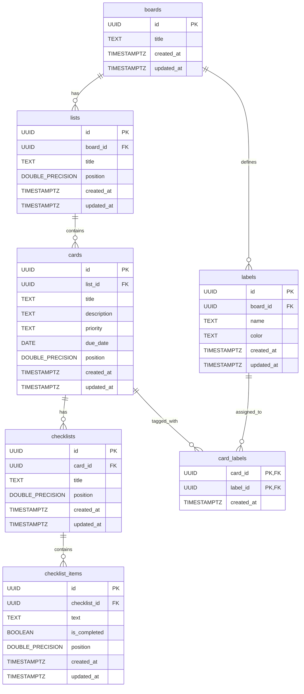

# データベース設計 — Trello 風タスク管理アプリ

> 本書は [要件定義書](要件定義書.md) §3 機能要件 / §4 画面要件 / [機能要件.md](機能要件.md) / [画面仕様書.md](画面仕様書.md) を踏まえた、**PostgreSQL 向け** 物理データモデルの設計書です。
>
> データベースは **PostgreSQL 16** を使用する(要件定義書 §6 参照)。§7 に実際の DDL(CREATE TABLE / CREATE INDEX)を掲載する。

---

## 1. 設計方針

| 方針 | 内容 | 根拠 |
| --- | --- | --- |
| 単一ユーザー前提 | `users` テーブルは設けない。ボードがトップレベルのエンティティ。 | 要件定義書 §5.3 / §6 |
| ID は **UUID 型** | 全エンティティの主キーは PostgreSQL ネイティブの `UUID` 型。デフォルトは `gen_random_uuid()`(PostgreSQL 13 以降 標準組み込み・拡張不要)。FK も `UUID` 型で統一。 | PostgreSQL 最適化、インデックス効率 |
| 並び順は **DOUBLE PRECISION の position** | 並び替え時に隣接 2 件の中点を採用する Trello 方式。挿入時に他レコードを更新しない。`REAL`(単精度)より精度が高く精度限界に達するまでの操作回数が多い。 | F-D-01〜03 / 性能要件 §5.2(100ms 以内) |
| カスケード削除 | 親エンティティ削除時に配下を自動削除(物理削除)。FK の `ON DELETE CASCADE` で実現。 | F-B-05 / F-L-03 / F-C-04 / F-LB-03 / F-CL-03 |
| タイムスタンプは **TIMESTAMPTZ** | `TIMESTAMP WITH TIME ZONE` を使用。タイムゾーン情報を保持し、将来的な多地域展開やログ解析に備える。デフォルトは `NOW()`。 | PostgreSQL ベストプラクティス |
| 期日は **DATE** 型 | 時刻は持たない(年月日のみ)。 | F-DD-01(機能要件 §6) |
| ラベル色は **TEXT(HEX)** + 正規表現 CHECK | `#RRGGBB` 形式。CHECK 制約で `color ~ '^#[0-9A-Fa-f]{6}$'` を使用(PostgreSQL の `~` 演算子)。 | 画面仕様書 §5 |
| 優先度は **TEXT + CHECK 制約** | `'high'` / `'medium'` / `'low'` の 3 値。PostgreSQL の ENUM 型は JPA との相性が複雑なため CHECK 制約で代替。 | F-PR-01(機能要件 §9) |
| 制約には明示的な名前を付与 | `CONSTRAINT pk_xxx` / `CONSTRAINT fk_xxx` / `CONSTRAINT ck_xxx` の命名規則で全制約に名前を付ける。エラー特定・マイグレーション管理が容易になる。 | PostgreSQL ベストプラクティス |

---

## 2. ER 図



#### カーディナリティ要約

| 関係 | 多重度 | 備考 |
| --- | --- | --- |
| Board — List | 1:N | ボード削除時にリストもカスケード削除(F-B-05)。 |
| Board — Label | 1:N | ラベルは **ボード単位** で定義(機能要件 §5)。 |
| List — Card | 1:N | リスト削除時にカードもカスケード削除(F-L-03)。 |
| Card — Checklist | 1:N | カード内に 0 件以上のチェックリスト(F-CL-01)。 |
| Card — Label | M:N | `card_labels` 中間表で実現(F-LB-04)。 |
| Checklist — ChecklistItem | 1:N | チェックリスト削除時に項目もカスケード削除(F-CL-03)。 |

---

## 3. テーブル定義

### 3.1 `boards` — ボード

| カラム | 型 | NULL | デフォルト | 説明 |
| --- | --- | --- | --- | --- |
| `id` | UUID | NO | `gen_random_uuid()` | **PK**。 |
| `title` | TEXT | NO | — | ボード名。空文字不可(CHECK 制約)。 |
| `created_at` | TIMESTAMPTZ | NO | `NOW()` | 作成日時。 |
| `updated_at` | TIMESTAMPTZ | NO | `NOW()` | 更新日時(改名時等)。 |

#### 制約
- `CONSTRAINT pk_boards PRIMARY KEY (id)`
- `CONSTRAINT ck_boards_title CHECK (length(trim(title)) > 0)`

---

### 3.2 `lists` — リスト(ボード内の列)

| カラム | 型 | NULL | デフォルト | 説明 |
| --- | --- | --- | --- | --- |
| `id` | UUID | NO | `gen_random_uuid()` | **PK**。 |
| `board_id` | UUID | NO | — | **FK → boards.id**。 |
| `title` | TEXT | NO | — | リスト名。空文字不可。 |
| `position` | DOUBLE PRECISION | NO | — | ボード内左右順を表す浮動小数点。昇順で表示。 |
| `created_at` | TIMESTAMPTZ | NO | `NOW()` | |
| `updated_at` | TIMESTAMPTZ | NO | `NOW()` | |

#### 制約
- `CONSTRAINT pk_lists PRIMARY KEY (id)`
- `CONSTRAINT fk_lists_board FOREIGN KEY (board_id) REFERENCES boards(id) ON DELETE CASCADE`
- `CONSTRAINT ck_lists_title CHECK (length(trim(title)) > 0)`

---

### 3.3 `cards` — カード(タスク)

| カラム | 型 | NULL | デフォルト | 説明 |
| --- | --- | --- | --- | --- |
| `id` | UUID | NO | `gen_random_uuid()` | **PK**。 |
| `list_id` | UUID | NO | — | **FK → lists.id**。 |
| `title` | TEXT | NO | — | カードタイトル。空文字不可(機能要件 §3)。 |
| `description` | TEXT | YES | NULL | 複数行説明。任意。 |
| `priority` | TEXT | NO | `'medium'` | 優先度。`'high'` / `'medium'` / `'low'` のいずれか(F-PR-01)。 |
| `due_date` | DATE | YES | NULL | 期日(年月日のみ)。任意(F-DD-01)。 |
| `position` | DOUBLE PRECISION | NO | — | リスト内縦順(昇順)。 |
| `created_at` | TIMESTAMPTZ | NO | `NOW()` | |
| `updated_at` | TIMESTAMPTZ | NO | `NOW()` | |

#### 制約
- `CONSTRAINT pk_cards PRIMARY KEY (id)`
- `CONSTRAINT fk_cards_list FOREIGN KEY (list_id) REFERENCES lists(id) ON DELETE CASCADE`
- `CONSTRAINT ck_cards_title CHECK (length(trim(title)) > 0)`
- `CONSTRAINT ck_cards_priority CHECK (priority IN ('high', 'medium', 'low'))`

---

### 3.4 `labels` — ラベル(ボード単位で定義)

| カラム | 型 | NULL | デフォルト | 説明 |
| --- | --- | --- | --- | --- |
| `id` | UUID | NO | `gen_random_uuid()` | **PK**。 |
| `board_id` | UUID | NO | — | **FK → boards.id**。 |
| `name` | TEXT | NO | — | ラベル名。空文字不可(画面仕様書 §5)。 |
| `color` | TEXT | NO | — | `#RRGGBB` のカラーコード。パレットから選択。 |
| `created_at` | TIMESTAMPTZ | NO | `NOW()` | |
| `updated_at` | TIMESTAMPTZ | NO | `NOW()` | |

#### 制約
- `CONSTRAINT pk_labels PRIMARY KEY (id)`
- `CONSTRAINT fk_labels_board FOREIGN KEY (board_id) REFERENCES boards(id) ON DELETE CASCADE`
- `CONSTRAINT ck_labels_name CHECK (length(trim(name)) > 0)`
- `CONSTRAINT ck_labels_color CHECK (color ~ '^#[0-9A-Fa-f]{6}$')` — PostgreSQL の `~` 演算子(POSIX 正規表現)

---

### 3.5 `card_labels` — カードとラベルの中間表(M:N)

| カラム | 型 | NULL | デフォルト | 説明 |
| --- | --- | --- | --- | --- |
| `card_id` | UUID | NO | — | **PK / FK → cards.id**。 |
| `label_id` | UUID | NO | — | **PK / FK → labels.id**。 |
| `created_at` | TIMESTAMPTZ | NO | `NOW()` | 付与日時。 |

#### 制約
- `CONSTRAINT pk_card_labels PRIMARY KEY (card_id, label_id)` — 同一カードに同一ラベルの重複付与を禁止
- `CONSTRAINT fk_card_labels_card  FOREIGN KEY (card_id)  REFERENCES cards(id)  ON DELETE CASCADE`
- `CONSTRAINT fk_card_labels_label FOREIGN KEY (label_id) REFERENCES labels(id) ON DELETE CASCADE` — F-LB-03(ラベル削除でカードからも自動的に外れる)を FK で実現

---

### 3.6 `checklists` — チェックリスト

| カラム | 型 | NULL | デフォルト | 説明 |
| --- | --- | --- | --- | --- |
| `id` | UUID | NO | `gen_random_uuid()` | **PK**。 |
| `card_id` | UUID | NO | — | **FK → cards.id**。 |
| `title` | TEXT | NO | — | チェックリスト名。空文字不可。 |
| `position` | DOUBLE PRECISION | NO | — | カード内表示順。 |
| `created_at` | TIMESTAMPTZ | NO | `NOW()` | |
| `updated_at` | TIMESTAMPTZ | NO | `NOW()` | |

#### 制約
- `CONSTRAINT pk_checklists PRIMARY KEY (id)`
- `CONSTRAINT fk_checklists_card FOREIGN KEY (card_id) REFERENCES cards(id) ON DELETE CASCADE`
- `CONSTRAINT ck_checklists_title CHECK (length(trim(title)) > 0)`

---

### 3.7 `checklist_items` — チェックリスト項目

| カラム | 型 | NULL | デフォルト | 説明 |
| --- | --- | --- | --- | --- |
| `id` | UUID | NO | `gen_random_uuid()` | **PK**。 |
| `checklist_id` | UUID | NO | — | **FK → checklists.id**。 |
| `text` | TEXT | NO | — | 項目のテキスト。空文字不可。 |
| `is_completed` | BOOLEAN | NO | `FALSE` | 完了 / 未完了(F-CL-05)。 |
| `position` | DOUBLE PRECISION | NO | — | チェックリスト内表示順。 |
| `created_at` | TIMESTAMPTZ | NO | `NOW()` | |
| `updated_at` | TIMESTAMPTZ | NO | `NOW()` | |

#### 制約
- `CONSTRAINT pk_checklist_items PRIMARY KEY (id)`
- `CONSTRAINT fk_checklist_items_checklist FOREIGN KEY (checklist_id) REFERENCES checklists(id) ON DELETE CASCADE`
- `CONSTRAINT ck_checklist_items_text CHECK (length(trim(text)) > 0)`

---

## 4. インデックス設計

主キー以外に張るセカンダリインデックスを、**それを使う具体的な操作・要件 ID** とともに記す。

| # | インデックス | 対象テーブル | カラム | 用途(対応する操作・要件) |
| --- | --- | --- | --- | --- |
| IX-1 | `idx_lists_board_position` | `lists` | `(board_id, position)` | カンバン画面でボード配下のリストを左から順に取得(F-L-04 / 画面仕様書 §3) |
| IX-2 | `idx_cards_list_position` | `cards` | `(list_id, position)` | 各リスト内のカードを上から順に取得(F-D-01〜02 / 画面仕様書 §3) |
| IX-3 | `idx_labels_board` | `labels` | `(board_id)` | ボードに紐づくラベル一覧の取得(F-LB-01〜03 / ラベル管理モーダル §5) |
| IX-4 | `idx_card_labels_label` | `card_labels` | `(label_id, card_id)` | ラベル削除や将来のラベルフィルタで「このラベルが付いたカード」を逆引き(F-LB-03) |
| IX-5 | `idx_checklists_card_position` | `checklists` | `(card_id, position)` | カード詳細モーダルでチェックリストを順序通りに描画(F-CL-01 / 画面仕様書 §4) |
| IX-6 | `idx_checklist_items_checklist_position` | `checklist_items` | `(checklist_id, position)` | チェックリスト内の項目を順序通りに描画(F-CL-04〜06) |

#### あえて張らないインデックス

| カラム | 理由 |
| --- | --- |
| `cards.due_date` | MVP の期限日順ソート(F-SR-02)はカードを全件メモリに展開したうえでクライアント側でソートする実装のため、DB インデックスを用いるクエリは発生しない。複数ボード横断の期限フィルタはスコープ外(要件定義書 §7)。将来サーバーサイドソートに移行する際は追加を検討。 |
| `cards.priority` | MVP の優先度順ソート(F-SR-01)も同様にクライアントサイドソート。DB レベルの絞り込みは発生しない。 |
| `boards.title` | 検索機能はスコープ外。ボード一覧は全件取得で問題ない規模(性能要件 §5.2)。 |
| `cards.title` / `description` | 同上(検索 / フィルタはスコープ外)。 |
| `card_labels (card_id, label_id)` の主キー以外の `(card_id, ...)` 索引 | 主キーが既に `(card_id, label_id)` 順なので、カード単位の付与ラベル取得はそれで足りる。 |

---

## 5. 並び順(`position`)の運用ルール

### 5.1 採番方式

- 新規挿入時は `position = max(position) + STEP`(例: STEP = 1024)。
- 2 件の間に挿入する場合は **隣接 2 件の中点**(`(prev.position + next.position) / 2`)。
- 先頭への挿入は `position = min(position) / 2`。

### 5.2 再採番(リバランス)

浮動小数点の精度限界に近づいた場合(例: 隣接差が `1e-9` 未満など)、対象スコープ(同一ボード内のリスト、同一リスト内のカード等)で **`position = STEP, 2*STEP, 3*STEP, …` に一括再採番** する。
カードが数百規模なら頻度は極めて低い。

### 5.3 並び替え時の更新範囲

| 操作 | 影響レコード数 | 備考 |
| --- | --- | --- |
| 同一リスト内のカード移動(F-D-01) | 1 行のみ(対象カードの `position`) | 隣接の中点採用 |
| リスト間のカード移動(F-D-02) | 1 行のみ(対象カードの `list_id` と `position`) | |
| リスト並べ替え(F-D-03) | 1 行のみ(対象リストの `position`) | |

これにより F-D-01〜03 がいずれも 1 行 UPDATE で完了し、性能要件 §5.2(100ms 以内)を余裕で満たす。

---

## 6. 主要クエリパターン

| 画面・操作 | 概念クエリ | 利用インデックス |
| --- | --- | --- |
| ボード一覧画面表示 | `SELECT * FROM boards ORDER BY created_at` | PK のみ(全件) |
| カンバン画面オープン | (1) リスト取得: `SELECT * FROM lists WHERE board_id = ? ORDER BY position` <br>(2) カード取得: `SELECT * FROM cards WHERE list_id = ANY(?) ORDER BY list_id, position` <br>(3) ラベル取得: `SELECT * FROM labels WHERE board_id = ?` <br>(4) カード付与ラベル: `SELECT * FROM card_labels WHERE card_id = ANY(?)` | IX-1, IX-2, IX-3, PK(card_labels) |
| カード詳細モーダル表示 | (1) カード本体 <br>(2) `SELECT * FROM checklists WHERE card_id = ? ORDER BY position` <br>(3) `SELECT * FROM checklist_items WHERE checklist_id = ANY(?) ORDER BY checklist_id, position` <br>(4) `SELECT label_id FROM card_labels WHERE card_id = ?` | PK, IX-5, IX-6, PK(card_labels) |
| ラベル削除(F-LB-03) | `DELETE FROM labels WHERE id = ?` → FK の ON DELETE CASCADE が `card_labels` を自動削除 | IX-4(逆引き)+ PK(card_labels) |
| チェックリスト進捗(F-CL-06) | `SELECT count(*) AS total, sum(is_completed::int) AS done FROM checklist_items WHERE checklist_id = ?` | IX-6 |

> **Note**: PostgreSQL では `IN (...)` より `= ANY(?)` + 配列バインドの方が JPA / JDBC との相性が良い場合がある。Spring Data JPA では `@Query` + `IN :ids` を使用すれば自動的に展開される。

---

## 7. PostgreSQL DDL

Flyway マイグレーションファイル(`V1__init_schema.sql`)として適用する想定の DDL。

```sql
-- boards
CREATE TABLE boards (
    id          UUID             NOT NULL DEFAULT gen_random_uuid(),
    title       TEXT             NOT NULL,
    created_at  TIMESTAMPTZ      NOT NULL DEFAULT NOW(),
    updated_at  TIMESTAMPTZ      NOT NULL DEFAULT NOW(),
    CONSTRAINT  pk_boards        PRIMARY KEY (id),
    CONSTRAINT  ck_boards_title  CHECK (length(trim(title)) > 0)
);

-- lists
CREATE TABLE lists (
    id          UUID             NOT NULL DEFAULT gen_random_uuid(),
    board_id    UUID             NOT NULL,
    title       TEXT             NOT NULL,
    position    DOUBLE PRECISION NOT NULL,
    created_at  TIMESTAMPTZ      NOT NULL DEFAULT NOW(),
    updated_at  TIMESTAMPTZ      NOT NULL DEFAULT NOW(),
    CONSTRAINT  pk_lists         PRIMARY KEY (id),
    CONSTRAINT  fk_lists_board   FOREIGN KEY (board_id) REFERENCES boards(id) ON DELETE CASCADE,
    CONSTRAINT  ck_lists_title   CHECK (length(trim(title)) > 0)
);

-- cards
CREATE TABLE cards (
    id          UUID             NOT NULL DEFAULT gen_random_uuid(),
    list_id     UUID             NOT NULL,
    title       TEXT             NOT NULL,
    description TEXT,
    priority    TEXT             NOT NULL DEFAULT 'medium',
    due_date    DATE,
    position    DOUBLE PRECISION NOT NULL,
    created_at  TIMESTAMPTZ      NOT NULL DEFAULT NOW(),
    updated_at  TIMESTAMPTZ      NOT NULL DEFAULT NOW(),
    CONSTRAINT  pk_cards         PRIMARY KEY (id),
    CONSTRAINT  fk_cards_list    FOREIGN KEY (list_id) REFERENCES lists(id) ON DELETE CASCADE,
    CONSTRAINT  ck_cards_title   CHECK (length(trim(title)) > 0),
    CONSTRAINT  ck_cards_priority CHECK (priority IN ('high', 'medium', 'low'))
);

-- labels
CREATE TABLE labels (
    id          UUID             NOT NULL DEFAULT gen_random_uuid(),
    board_id    UUID             NOT NULL,
    name        TEXT             NOT NULL,
    color       TEXT             NOT NULL,
    created_at  TIMESTAMPTZ      NOT NULL DEFAULT NOW(),
    updated_at  TIMESTAMPTZ      NOT NULL DEFAULT NOW(),
    CONSTRAINT  pk_labels        PRIMARY KEY (id),
    CONSTRAINT  fk_labels_board  FOREIGN KEY (board_id) REFERENCES boards(id) ON DELETE CASCADE,
    CONSTRAINT  ck_labels_name   CHECK (length(trim(name)) > 0),
    CONSTRAINT  ck_labels_color  CHECK (color ~ '^#[0-9A-Fa-f]{6}$')
);

-- card_labels (M:N 中間表)
CREATE TABLE card_labels (
    card_id     UUID             NOT NULL,
    label_id    UUID             NOT NULL,
    created_at  TIMESTAMPTZ      NOT NULL DEFAULT NOW(),
    CONSTRAINT  pk_card_labels        PRIMARY KEY (card_id, label_id),
    CONSTRAINT  fk_card_labels_card   FOREIGN KEY (card_id)  REFERENCES cards(id)  ON DELETE CASCADE,
    CONSTRAINT  fk_card_labels_label  FOREIGN KEY (label_id) REFERENCES labels(id) ON DELETE CASCADE
);

-- checklists
CREATE TABLE checklists (
    id          UUID             NOT NULL DEFAULT gen_random_uuid(),
    card_id     UUID             NOT NULL,
    title       TEXT             NOT NULL,
    position    DOUBLE PRECISION NOT NULL,
    created_at  TIMESTAMPTZ      NOT NULL DEFAULT NOW(),
    updated_at  TIMESTAMPTZ      NOT NULL DEFAULT NOW(),
    CONSTRAINT  pk_checklists       PRIMARY KEY (id),
    CONSTRAINT  fk_checklists_card  FOREIGN KEY (card_id) REFERENCES cards(id) ON DELETE CASCADE,
    CONSTRAINT  ck_checklists_title CHECK (length(trim(title)) > 0)
);

-- checklist_items
CREATE TABLE checklist_items (
    id              UUID             NOT NULL DEFAULT gen_random_uuid(),
    checklist_id    UUID             NOT NULL,
    text            TEXT             NOT NULL,
    is_completed    BOOLEAN          NOT NULL DEFAULT FALSE,
    position        DOUBLE PRECISION NOT NULL,
    created_at      TIMESTAMPTZ      NOT NULL DEFAULT NOW(),
    updated_at      TIMESTAMPTZ      NOT NULL DEFAULT NOW(),
    CONSTRAINT  pk_checklist_items              PRIMARY KEY (id),
    CONSTRAINT  fk_checklist_items_checklist    FOREIGN KEY (checklist_id) REFERENCES checklists(id) ON DELETE CASCADE,
    CONSTRAINT  ck_checklist_items_text         CHECK (length(trim(text)) > 0)
);

-- セカンダリインデックス
CREATE INDEX idx_lists_board_position
    ON lists (board_id, position);

CREATE INDEX idx_cards_list_position
    ON cards (list_id, position);

CREATE INDEX idx_labels_board
    ON labels (board_id);

CREATE INDEX idx_card_labels_label
    ON card_labels (label_id, card_id);

CREATE INDEX idx_checklists_card_position
    ON checklists (card_id, position);

CREATE INDEX idx_checklist_items_checklist_position
    ON checklist_items (checklist_id, position);
```

---

## 8. スコープ外データ(将来検討)

要件定義書 §7 を踏まえ、本書では下記のテーブル / カラムは **設けない**。

- `users`, `board_members`(マルチユーザー / 共有)
- `comments`, `attachments`(コメント / 添付)
- `cards.cover_color`, `cards.cover_image`(カバー画像)
- 検索インデックス用テーブル / 全文検索カラム
- 監査ログ / 変更履歴

将来導入する場合は本モデルに対する **加算的な拡張** で対応可能(既存スキーマの破壊的変更を要しない設計)。

---

## 9. 改訂履歴

| 版 | 日付 | 内容 | 作成者 |
| --- | --- | --- | --- |
| 0.1 | 2026-05-03 | 初版作成。要件定義書 / 機能要件 / 画面仕様書を踏まえた論理データモデル(7 テーブル)、ER 図、インデックス設計、並び順運用ルール、永続化手段別マッピング指針を定義。 | - |
| 0.2 | 2026-05-03 | `cards` テーブルに `priority` カラム追加(F-PR-01)。設計方針・ER 図・テーブル定義・インデックス設計(あえて張らない理由)を更新。 | - |
| 0.3 | 2026-05-03 | PostgreSQL 16 確定に伴い全面改訂。ID を `UUID`(gen_random_uuid())に変更、タイムスタンプを `TIMESTAMPTZ` に変更、position を `DOUBLE PRECISION` に変更、カラー CHECK 制約を PostgreSQL 正規表現(`~`)に変更、全制約に明示的な名前を付与、§7 を汎用マッピングガイドから実際の PostgreSQL DDL に置き換え。 | - |
